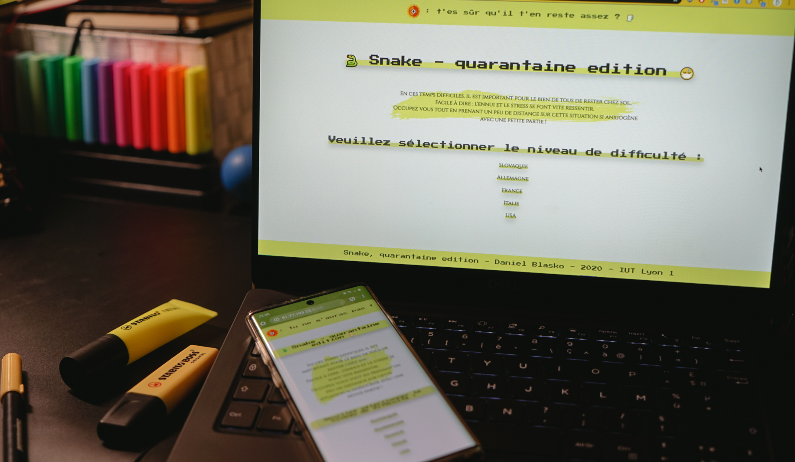

# JS Snake 🐍
A practical project for my JS course.

## Disclaimer

🛑 All creative choices have to be taken with a grain of salt and are not meant to offend anyone. 🛑

## Test it live ! 🚀
The CI (Github Actions) should ensure that a version of the project is currently running **[HERE](http://51.77.193.23:8000/)**.

However, if you want to try running the project locally or if the live version is down, please refer to the *Running the project* section below.

## Running the project 💻

* Clone the project on your machine.
* Open a terminal at the root of the project folder.
* Run `python3 -m http.server` if you have Python 3 installed. Else, use any web server you prefer. 
* **The project is then available at [0.0.0.0:8000](0.0.0.0:8000). Have fun ! 🐍**

## Instructions 

**Instructions are available [here](https://perso.liris.cnrs.fr/pierre-antoine.champin/enseignement/intro-js/s6.html).**